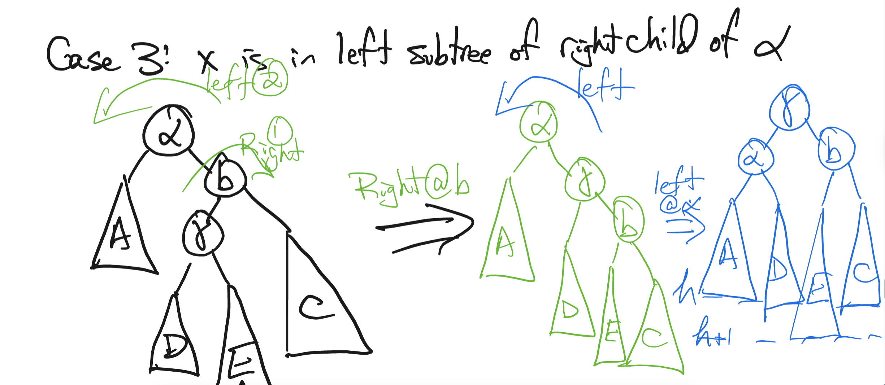

# Balanced Binary Search Tree

## Properties of BST

A binary search tree (BST) is a binary tree in which each node has a comparable key (and associated value) and satisfies the following properties:
1. The left subtree of a node contains only nodes with keys less than the node's key.
2. The right subtree of a node contains only nodes with keys greater than the node's key.
3. Both the left and right subtrees must also be BSTs.

一颗二叉搜索树应该做到的事情

```cpp
template<typename T>
class BST {
private:
    using ptr = unique_ptr<Node>;
    struct Node {
        T val;
        int cnt, siz, het; // count of duplicates, size of subtree, height
        ptr ch[2]; // children
        #define lk ((rt)->ch[0])
        #define rk ((rt)->ch[1])
        Node(const T& v) : val(v), cnt(1), siz(1), het(1) {}
    };
    ptr root;
    int cnt(ptr rt) const { return rt ? rt->cnt : 0; }
    int siz(ptr rt) const { return rt ? rt->siz : 0; }
    int het(ptr rt) const { return rt ? rt->het : 0; }

    bool contains(const ptr& rt, const T& v) const {
        if (!rt) return false;
        if (v == rt->val) return true;
        return contains(v < rt->val ? lk : rk, v);
    }
    void insert(ptr& rt, const T& v) {
        if (!rt) { rt = make_unique<Node>(v); return; }
        if (v == rt->val) rt->cnt++;
        else insert(v < rt->val ? lk : rk, v);
    }
    void remove(ptr& rt, const T& v) {
        if (!rt) return;
        if (v == rt->val) {
            if (rt->cnt > 1) { rt->cnt--; return; }
            if (!lk) { rt = move(rk); return; }
            if (!rk) { rt = move(lk); return; }
            ptr succ = getSuccessor(rt);
            rt->val = succ->val;
            rt->cnt = succ->cnt;
            succ->cnt = 1; // reset count before removal
            remove(rk, succ->val);
        } else remove(v < rt->val ? lk : rk, v);
    }
    ptr findMin(ptr rt) const {
        if (!rt) return nullptr;
        while (lk) rt = lk;
        return rt;
    }
    ptr findMax(ptr rt) const {
        if (!rt) return nullptr;
        while (rk) rt = rk;
        return rt;
    }
    ptr getPredecessor(ptr rt) const {
        if (!rt) return nullptr;
        return findMax(lk);
    }
    ptr getSuccessor(ptr rt) const {
        if (!rt) return nullptr;
        return findMin(rk);
    }
    ptr getPredecessor(ptr rt, const T& v) const {
        ptr cur = nullptr;
        while (rt) { //不断向右逼近
            if (rt->val < v) cur = rt, rt = rk;
            else rt = lk;
        }
        return cur;
    }
    ptr getSuccessor(ptr rt, const T& v) const {
        ptr cur = nullptr;
        while (rt) { //不断向左逼近
            if (rt->val > v) cur = rt, rt = lk;
            else rt = rk;
        }
        return cur;
    }
    int getRank(const ptr& rt, const T& v) const { //权值为v的排名
        if (!rt) return 0;
        if (v == rt->val) return siz(lk) + 1;
        if (v < rt->val) return getRank(lk, v);
        return siz(lk) + rt->cnt + getRank(rk, v);
    }
    ptr getByRank(const ptr& rt, int rnk) const { //排名为rnk的节点
        if (!rt) return nullptr;
        if (siz(lk) >= rnk) return getByRank(lk, rnk);
        if (siz(lk) + rt->cnt >= rnk) return rt;
        return getByRank(rk, rnk - siz(lk) - rt->cnt);
    }
    void inorder(const ptr& rt, vector<T>& res) const {
        if (!rt) return;
        inorder(lk, res);
        res.push_back(rt->val);
        inorder(rk, res);
    }

public:
    bool contains(const T& v) const { return contains(root, v); }
    void insert(const T& v) { insert(root, v); }
    void remove(const T& v) { remove(root, v); }
    T getMin() const { ptr res = findMin(root); if (!res) throw runtime_error("Tree is empty"); return res->val; }
    T getMax() const { ptr res = findMax(root); if (!res) throw runtime_error("Tree is empty"); return res->val; }
    T getPredecessor(const T& v) const { ptr res = getPredecessor(root, v); if (!res) throw runtime_error("No predecessor"); return res->val; }
    T getSuccessor(const T& v) const { ptr res = getSuccessor(root, v); if (!res) throw runtime_error("No successor"); return res->val; }
    int getRank(const T& v) const { return getRank(root, v); }
    T getByRank(int rnk) const { ptr res = getByRank(root, rnk); if (!res) throw runtime_error("Rank out of bounds"); return res->val; }

    vector<T> inorder() const { vector<T> v; inorder(root, v); return v; }
};
```

## Properties of Balanced BST

A balanced binary search tree is a binary search tree that maintains its height to be logarithmic in the number of nodes, ensuring efficient operations. Common types of balanced BSTs include AVL trees, red-black trees, splay trees, and treaps.

Worst-case $O(\log n)$ height, ensuring $O(\log n)$ for search, insertion, and deletion operations.

Denotaion:
- $h(rt)$: height of the subtree rooted at node `rt`.
- $lk$, $rk$: left and right kids of node `rt`.
- $\alpha$: the closest node whose subtree is unbalanced.

## AVL Tree (Adelson-Velsky and Landis Tree)

AVL树是一种严格平衡的二叉搜索树，任何节点的两个子树的高度最大差别为1。

Properties:
1. For every node $rt$, $|h(lk) - h(rk)| \leq 1$.

Algorithms:
1. Insert the new node as in a regular BST.
2. Backtrack to the root, updating heights and checking balance factors.
3. Perform appropriate rotations to restore balance. Do 1 or 2 rotations as needed.

Rotations: When insertion, left, left -> right rotation; right, right -> left rotation; left, right -> left-right rotation; right, left -> right-left rotation. On the lowest unbalanced node.

Four cases of rotations:
- Left-Left Case: $x$ inserted into left subtree of left child of $\alpha$.
- Right-Right Case: $x$ inserted into right subtree of right child of $\alpha$.
- Left-Right Case: $x$ inserted into right subtree of left child of $\alpha$.
- Right-Left Case: $x$ inserted into left subtree of right child of $\alpha$.




```cpp
#define BST AVL
struct BST
{
    int son[2];//左右子节点
    int val;//节点权值
    int siz, het;//节点个数、子树高度
    #define lk bt[rt].son[0]
    #define rk bt[rt].son[1]
}; BST bt[Z];
int root, tot;
inline void pushup(int rt)//更新信息
{
    bt[rt].siz = bt[lk].siz + bt[rk].siz + 1;
    bt[rt].het = max(bt[lk].het, bt[rk].het) + 1;
}
inline void rotate(int &rt, int op)//旋转
{
    int to = bt[rt].son[op ^ 1];
    bt[rt].son[op ^ 1] = bt[to].son[op], bt[to].son[op] = rt, rt = to;
    pushup(lk), pushup(rk), pushup(rt);
}
void insert(int &rt, int val)//插入新节点
{
    if (!rt) { bt[++tot].val = val; bt[tot].siz = bt[tot].het = 1; rt = tot; return; }
    if (val < bt[rt].val) insert(lk, val);
    else insert(rk, val);
    pushup(rt);
    if (bt[lk].het - bt[rk].het == 2)
    {
        if (val < bt[lk].val) rotate(rt, 1);//左左
        else { rotate(lk, 0), rotate(rt, 1); }//左右
    }
    else if (bt[rk].het - bt[lk].het == 2)
    {
        if (val > bt[rk].val) rotate(rt, 0);//右右
        else { rotate(rk, 1), rotate(rt, 0); }//右左
    }
}
void remove(int &rt, int val)//删除节点
{
    if (!rt) return;
    if (val == bt[rt].val)
    {
        if (bt[lk].siz && bt[rk].siz)
        {
            int to = lk;
            while (bt[to].son[1]) to = bt[to].son[1];
            bt[rt].val = bt[to].val;
            remove(lk, bt[to].val);
        }
        else rt = bt[lk].siz ? lk : rk;
    }
    else val < bt[rt].val ? remove(lk, val) : remove(rk, val);
    if (!rt) return;
    pushup(rt);
    if (bt[lk].het - bt[rk].het == 2)
    {
        if (bt[lk].het >= bt[rk].het) rotate(rt, 1);//左左
        else { rotate(lk, 0), rotate(rt, 1); }//左右
    }
    else if (bt[rk].het - bt[lk].het == 2)
    {
        if (bt[rk].het >= bt[lk].het) rotate(rt, 0);//右右
        else { rotate(rk, 1), rotate(rt, 0); }//右左
    }
}
```

## Treap

根据随机数据的平衡性，利用某一个评判标准（这里为大根堆），使二叉查找树有序化，使得其深度保持在$logn$。

```cpp
#define BST Treap
struct BST
{
    int son[2];//左右子节点
    int val, dat;//节点权值、大根堆判断标准
    int cnt, siz;//节点个数、子树大小
    #define lk bt[rt].son[0]
    #define rk bt[rt].son[1]
}; BST bt[Z];
int root, tot;
inline void pushup(int rt)//更新信息
{
    bt[rt].siz = bt[lk].siz + bt[rk].siz + bt[rt].cnt;
}
inline int est(int val)//建立新节点
{
    bt[++tot].val = val;
    bt[tot].dat = rand();
    bt[tot].cnt = bt[tot].siz = 1;
    return tot;
}
inline void build()//初始化
{
    root = est(-inf);
    bt[root].son[1] = est(inf);
    pushup(root);
}
inline void rotate(int &rt, int op)//旋转维护大根堆
{
    int to = bt[rt].son[op ^ 1];
    bt[rt].son[op ^ 1] = bt[to].son[op], bt[to].son[op] = rt, rt = to;
    pushup(lk), pushup(rk), pushup(rt);
}
void insert(int &rt, int val)//插入新节点
{
    if (!rt) { rt = est(val); return; }
    if (val == bt[rt].val) bt[rt].cnt++;
    else val < bt[rt].val ? insert(lk, val) : insert(rk, val);
    if (bt[rt].dat < bt[lk].dat) rotate(rt, 1);
    if (bt[rt].dat < bt[rk].dat) rotate(rt, 0);
    pushup(rt);
}
void remove(int &rt, int val)//删除节点
{
    if (!rt) return;
    if (val == bt[rt].val)
    {
        if (bt[rt].cnt > 1) bt[rt].cnt--;
        else if (lk || rk)//不是叶子节点，向下旋转使之成为叶子
        {
            if (!lk || bt[lk].dat < bt[rk].dat) rotate(rt, 0), remove(lk, val);
            else rotate(rt, 1), remove(rk, val);
        }
        else rt = 0;
    }
    else val < bt[rt].val ? remove(lk, val) : remove(rk, val);
    pushup(rt);
}
```

## Splay

每次对一个节点操作，都把它旋转到根，据说是有什么数据趋势平衡（玄学），精髓便在于$splay$函数。

```cpp
#define BST Splay
struct BST
{
    int son[2], dad;//子节点、父节点
    int val;//节点权值
    int cnt, siz;//节点个数、子树大小
    #define lk bt[rt].son[0]
    #define rk bt[rt].son[1]
    #define fa bt[rt].dad
    #define pa bt[bt[rt].dad].dad
}; BST bt[Z];
int root, tot;
inline void pushup(int rt)//更新信息
{
    bt[rt].siz = bt[lk].siz + bt[rk].siz + bt[rt].cnt;
}
inline int est(int val, int dad)//建立新节点
{
    bt[++tot].val = val;
    bt[tot].dad = dad;
    bt[tot].cnt = bt[tot].siz = 1;
    return tot;
}
inline void build()//初始化
{
    root = est(-inf, 0);
    bt[root].son[1] = est(inf, root);
    pushup(root);
}
void build(int &rt, int dad, int l, int r)//递归建树
{
    if (l > r) return 0;
    int mid = l + r >> 1; rt = est(a[mid], dad);
    build(lk, rt, l, mid - 1), build(rk, rt, mid + 1, r);
    pushup(rt);
}
inline bool get(int rt)//左孩子还是右孩子
{
    return bt[fa].son[1] == rt;
}
inline void un(int rt, int dad, int kid)//把rt接在dad的kid儿子上
{
    bt[dad].son[kid] = rt, fa = dad;
}
inline void rotate(int rt)//上旋
{
    int dad = fa, kid = get(rt);
    un(rt, pa, get(fa));//儿子先取代父亲
    un(bt[rt].son[kid ^ 1], dad, kid);//把儿子的孩子给父亲
    un(dad, rt, kid ^ 1);//把父亲变为rt的儿子
    pushup(dad), pushup(rt);
}
inline void splay(int rt, int to)//将rt旋转为to的儿子
{
    while (fa != to)
    {
        if (pa != to) rotate(get(rt) == get(fa) ? fa : rt);
        rotate(rt);
    }
    if (!to) root = rt;//更新树根
}
void insert(int &rt, int val, int dad)//插入节点
{
    if (!rt) { rt = est(val, dad), splay(rt, 0); return; }
    if (val == bt[rt].val) bt[rt].cnt++, bt[rt].siz++, splay(rt, 0);
    else val < bt[rt].val ? insert(lk, val, rt) : insert(rk, val, rt);
}
void remove(int rt, int val)//删除节点
{
    if (!rt) return;
    if (val == bt[rt].val)
    {
        if (bt[rt].cnt > 1) bt[rt].cnt--, bt[rt].siz--, splay(rt, 0);
        else if (lk) rotate(lk), remove(rt, val);
        else if (rk) rotate(rk), remove(rt, val);
        else bt[fa].son[get(rt)] = 0, splay(fa, 0);//成为了叶子节点
    }
    else val < bt[rt].val ? remove(lk, val) : remove(rk, val);
}
```

## FHQ-Treap

```cpp
#define BST FHQ-Treap
struct BST
{
    int son[2];//左右子节点
    int val, dat;//节点权值、大根堆判断标准
    int siz;//节点个数、子树大小
    #define lk bt[rt].son[0]
    #define rk bt[rt].son[1]
}; BST bt[Z];
int root, tot;
inline int est(int val)
{
    bt[++tot].val = val;
    bt[tot].dat = rand();
    bt[tot].siz = 1;
    return tot;
}
inline void pushup(int rt)
{
    bt[rt].siz = bt[lk].siz + bt[rk].siz + 1;
}
inline void build()
{
    root = est(-inf);
    bt[root].son[1] = est(inf);
    pushup(root);
}
void split(int rt, int val, int &x, int &y)
{
    if (!rt) { x = y = 0; return; }
    if (bt[rt].val <= val) x = rt, split(rk, val, rk, y);
    else y = rt, split(lk, val, x, lk);
    pushup(rt);
}
int merge(int x, int y)
{
    int rt = x + y;
    if (!x || !y) return rt;
    if (bt[x].dat > bt[y].dat) rt = x, rk = merge(rk, y);
    else rt = y, lk = merge(x, lk);
    pushup(rt); return rt;
}
inline void insert(int val)
{
    int x, y;
    split(root, val - 1, x, y);
    root = merge(merge(x, est(val)), y);
}
inline void remove(int val)
{
    int x, y, z;
    split(root, val, x, z);
    split(x, val - 1, x, y);
    //只删除一个
    if (y) y = merge(bt[y].son[0], bt[y].son[1]);
    root = merge(merge(x, y), z);
    //删除全部
    // root = merge(x, z);
}
```
