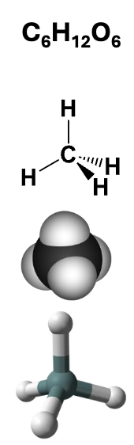
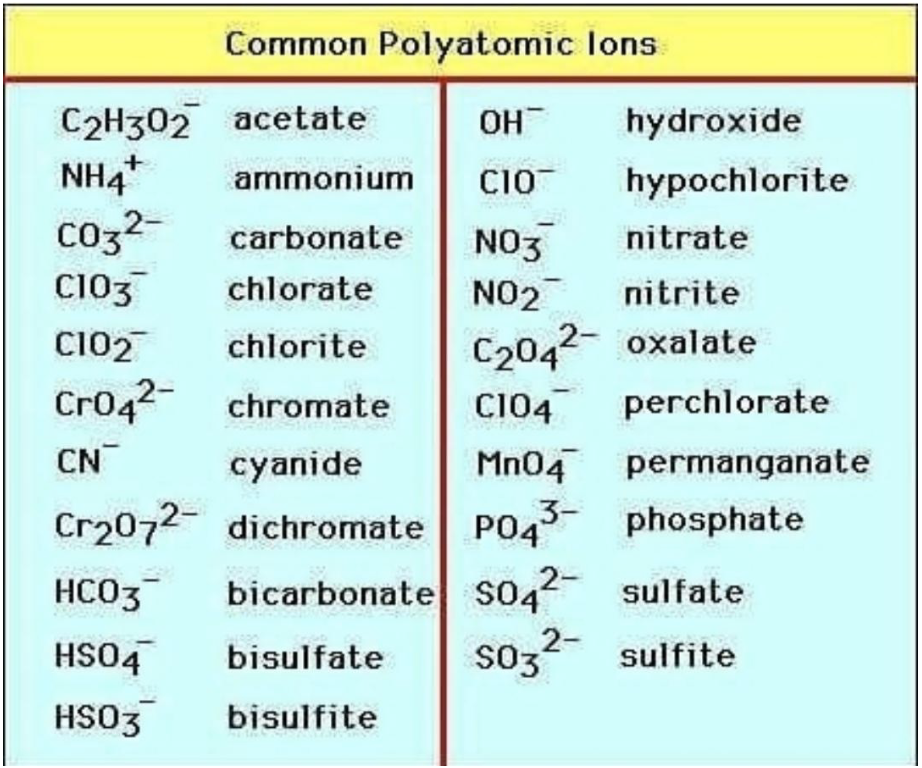

# Chemistry 1A: General Chemistry

## Table of Contents

## Modern Fundamental Laws

- **Law of Conservation of Mass**: mass is neither created nor destroyed in a chemical reaction.
- **Law of Definite Proportion**: a given compound always contains the same proportion of elements by mass.
- **Law of Multiple Proportions**: when two elements form multiple compounds, the mass ratios can be reduced to small whole numbers.

## Atoms

- **Protons**: *Positively charged* subatomic particles found in the nucleus of an atom. They determine the atomic number and identity of an element.
- **Neutrons**: *Chargeless* subatomic particles also found in the nucleus. They contribute to the atomic mass but do not affect the charge of the atom.
- **Electrons**: *Negatively charged* subatomic particles that orbit the nucleus in electron shells. They are involved in chemical bonding and reactions.

### Atomic Symbols

- **Elemental Symbol**: A one- or two-letter abbreviation for an element (e.g., H for hydrogen, O for oxygen).
- **Atomic Number**: The number of **protons** in the nucleus of an atom, which defines the element.
- **Mass Number**: The total number of **protons and neutrons** in the nucleus of an atom.
- **Nuclear Symbol**: A notation that includes the mass number and atomic number. (e.g. $ ^{12}_{6}C $ for carbon-12)  
$\text{Nuclear Symbol} = \begin{pmatrix} \text{Mass Number} \\ \text{Atomic Number} \end{pmatrix} \text{Element Symbol}$

### Types of Atoms

- **Elementary Substances**: Pure substances that consist of only one type of atom. They can be classified as:
    - **Monoatomic**: meaning they consist of single atoms. (e.g., He, Ne)
    - **Diatomic molecules** (e.g., O₂, N₂) or **polyatomic molecules** (e.g., S₈).
- **Isotopes**: Atoms of the same element that have different numbers of neutrons, resulting in different mass numbers. Isotopes can be stable or radioactive.

### Periodic Table

- Elements are organized by **increasing atomic number**.
- Each element in a cell contains its elemental symbol, atomic number, and the atomic mass. Atomic mass is the **weighted average** of the masses of an element's isotopes.
- Rows are called **periods** and columns are called **groups**.
- Broadly, **metals** are on the left and center, while **nonmetals** are on the upper right.

### Molecules and Chemical Bonds

- Atoms can combine by **sharing electrons** in a **covalent bond** to form a **molecule**.

#### Ways to Represent Molecules

- **Chemical formula**: shows how many of each atom are present, but not connectivity. $C_6H_{12}O_6$
- **Structural formula**: shows atoms and bonds.
- **Space-filling model**: shows relative atom size and occupied space.
- **Ball-and-stick model**: shows bonds clearly with 3D spheres.

### Ions

- **Ions**: atoms or molecules with a net *charge* due to an imbalance of protons and electrons.
    - **Simple ions**: single atoms that have gained or lost electrons. Examples include $Na^+$, $Cl^-$, and $O^{2-}$.
    - **Polyatomic ions**: groups of atoms that together have a net charge. Examples include $NH_4^+$ (ammonium) and $SO_4^{2-}$ (sulfate).
- **Cations**: **positively** charged ions with more protons than electrons. ($H^+$, $Na^+$, $NH_4^+$)
- **Anions**: **negatively** charged ions with more electrons than protons. ($OH^-$, $F^-$, $NH_2^-$)
- **Ionic Compounds**: compounds formed from cations and anions held together by **ionic bonds**. The electrons in ionic bonds are not shared but transferred from one atom to another, resulting in the formation of ions.

### Determining Charge

- **Group 1** elements usually form **+1** ions.
- **Group 2** elements usually form **+2** ions.
- **Group 13** elements usually form **+3** ions.
- **Group 14** elements can often be **$\pm 4$**.
- **Group 15** elements usually form **-3** ions.
- **Group 16** elements usually form **-2** ions.
- **Group 17** elements usually form **-1** ions.
- **Group 18** elements are very difficult to ionize and are usually found as **neutral atoms**.

#### Covalent and Ionic Bonds

- Elements on the **left side** of the periodic table are generally more stable as **cations**. Elements on the **right side** are generally more stable as **anions**.
- Observations:
  - **Metal + nonmetal** usually gives an **ionic compound**.
  - **Nonmetal + nonmetal** usually gives a **covalent compound**.

## Naming Chemical Compounds

### Type I Binary Ionic Compounds

- These contain **one type of cation** and **one type of anion**.
- The cation has only **one possible charge**.

Naming Rules
- Name the **cation first** and the **anion second**.
- The cation keeps its **element name**.
- The anion uses the beginning of the element name plus **`-ide`**.

Examples
- **NaCl**: sodium chloride
- **HBr**: hydrogen bromide
- **$Be_3N_2$**: beryllium nitride

### Acids

- Ionic compounds that begin with **H** are often treated separately as **acids**.
- For binary acids:
  - Use **hydro-**
  - Use the anion root
  - End with **`-ic acid`**

Examples
- **HBr**: **hydrobromic acid**.
- **HCl**: **hydrochloric acid**.

### Type II Binary Ionic Compounds

- These involve metals, often **transition metals**, that can have **more than one charge**.

Naming Rules
- Name the cation first.
- Follow with a **Roman numeral** in parentheses showing the cation charge.
- Name the anion second using **`-ide`**.

Examples
- **$FeCl_3$**: iron (III) chloride
- **$Cu_2S$**: copper (I) sulfide
- **$Co_3N_4$**: cobalt (IV) nitride

### Type III Binary Compounds

- These are **covalently bonded molecules**.
- They contain **two nonmetal elements**.

Naming Rules
- Name the **first element** first using its full element name.
- Name the **second element** like an anion, ending in **`-ide`**.
- Use numerical prefixes such as **mono-**, **di-**, **tri-**, and **tetra-** to show the number of atoms present. **Mono-** is used only on the **second element**, never the first.

Examples
- **$CO$**: carbon monoxide
- **$N_2O_3$**: dinitrogen trioxide
- **$N_2O_4$**: dinitrogen tetroxide

### Chemical Formula vs. Empirical Formula

- **Empirical formula**: the **simplest whole-number ratio** of elements in a compound.
- **Chemical formula**: the formula that gives the **actual number of each type of atom** in the molecule.
- Different compounds can have the **same empirical formula** but different chemical formulas.

## Stoichiometry

### SI System

**International System of Units**.

| Quantity | Meaning | SI Unit |
| --- | --- | --- |
| **Mass** | measure of how a material resists change in motion | kilogram (kg) |
| **Length** | one-dimensional distance between two points | meter (m) |
| **Time** | duration of an event | second (s) |
| **Temperature** | thermal energy scale of a system | kelvin (K) |
| **Amount of substance** | quantity of particles / chemical entities | mole (mol) |

Temperature Scales: **Kelvin** (K), **Celsius** ($^\circ C$), and **Fahrenheit** ($^\circ F$).

### SI Unit Prefixes

| Prefix | Symbol | Factor |
| --- | --- | --- |
| atto | a | $10^{-18}$ |
| femto | f | $10^{-15}$ |
| pico | p | $10^{-12}$ |
| nano | n | $10^{-9}$ |
| micro | $\mu$ | $10^{-6}$ |
| milli | m | $10^{-3}$ |
| centi | c | $10^{-2}$ |
| deci | d | $10^{-1}$ |
| deka | da | $10^1$ |
| hecto | h | $10^2$ |
| kilo | k | $10^3$ |
| mega | M | $10^6$ |
| giga | G | $10^9$ |
| tera | T | $10^{12}$ |
| peta | P | $10^{15}$ |
| exa | E | $10^{18}$ |

### Atomic Mass

- **Mass number** is an integer for a specific isotope.
- **Atomic mass** is the weighted average mass of all naturally occurring isotopes. In **atomic mass units (amu)**.
- In chemical reactions, use the **atomic mass** from the periodic table rather than a single isotope's mass number.

## The Mole and Avogadro's Number

**Avogadro's number**: $1\ \text{mol} = 6.022 \times 10^{23}\ \text{particles}$

### Molar Mass and Mass Percent

The periodic table's atomic mass also gives the **molar mass** of a natural element in g/mol.

$$
12.01\ \text{g natural C} = 1\ \text{mol natural C} = 6.022 \times 10^{23}\ \text{C atoms}
$$

**Molar mass** is the mass of 1 mole of a substance. For an element, use the atomic mass from the periodic table and change the unit from **amu/atom** to **g/mol**.
Example: C has atomic mass about **12.01 amu/atom**, so its molar mass is **12.01 g/mol**.

## Chemical Reactions

- **Reactants**: starting materials
- **Products**: substances formed
- **Reaction arrow**: shows the direction from reactants to products

### Percent Yield

- A **limiting reactant** is the reactant that gets used up first in a chemical reaction.
- **Theoretical yield** is the maximum amount of product that can be formed if the limiting reactant is used up completely.
- **Percent yield** compares actual product obtained to theoretical product expected.

$$
\%\text{ yield} = \frac{\text{actual yield}}{\text{theoretical yield}} \times 100\%
$$

## Solution

- A **solution** is a homogeneous mixture of **solute** and **solvent** in the same phase.
- **Solvent**: the substance causing the dissolving.
- **Solute**: the substance being dissolved.
- **Dissolve**: moving the solute into the same phase as the solvent.

### Electrolyte Solution

**Dissociation**: When ionic compounds dissolve in solution, they separate into ions (cations and anions).

- Compounds that dissociate in solution are **electrolytes**.
- Covalent molecules that dissolve but do not dissociate are **nonelectrolytes**.

#### Electrolyte Strength and Conductivity

- **Strong electrolytes** dissociate completely.
- **Weak electrolytes** dissociate only partially.
- Stronger electrolytes conduct electricity better because they produce more ions in solution.

### Acids and Bases

Acids and bases are special types of electrolytes.

- **Acids**: ionic compounds containing $H^+$ ions.
- **Bases**: ionic compounds containing $OH^-$ ions or help make $OH^-$ in solution.

- **Strong acids/bases** dissociate essentially **100%** in solution.
- **Weak acids/bases** dissociate only **partially**.

Examples:

- **Strong acids**: $\mathrm{HCl}$, $\mathrm{HBr}$, $\mathrm{HI}$, $\mathrm{HNO_3}$, $\mathrm{H_2SO_4}$, $\mathrm{HClO_4}$, $\mathrm{HClO_3}$
- **Strong bases**: $\mathrm{LiOH}$, $\mathrm{NaOH}$, $\mathrm{KOH}$, $\mathrm{RbOH}$, $\mathrm{CsOH}$, $\mathrm{Ca(OH)_2}$, $\mathrm{Sr(OH)_2}$, $\mathrm{Ba(OH)_2}$
- **Weak acids**: $\mathrm{HF}$, $\mathrm{CH_3COOH}$
- **Weak bases**: $\mathrm{NH_3}$, $\mathrm{NaOCl}$

### Concentration

**Molarity**:

$$
M = \frac{mol}{L} = \frac{\text{moles of solute}}{\text{liters of solution}}
$$

Square-bracket notation like **[NaCl]** means the molar concentration of that solute.
