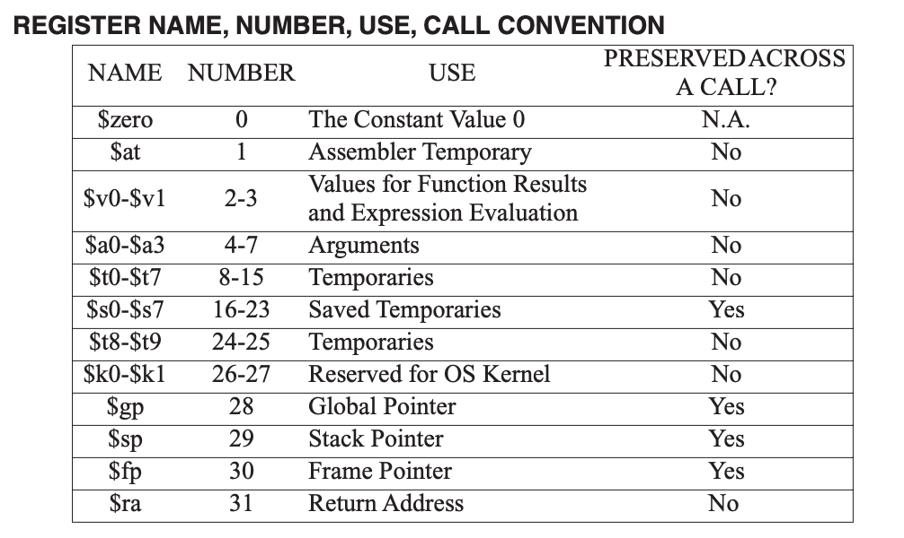
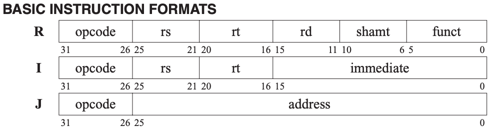

# CMPSC 64: Computer Organization and Architecture

## Table of Contents

## Von Neumann Architecture

The 5 main components of a computer: 
1. Processor (CPU)
2. Memory (RAM)
3. Input Devices (Keyboard)
4. Output Devices (Display Screen)
5. Secondary Data Storage (SSD)

Memory is composed of data address and data value. Each memory address stores a data value.

## Binary Number System

Base 10 (decimal): digits 0-9.  
Base 2 (binary): digits 0 and 1.  
Base 8 (octal): digits 0-7.  
Base 16 (hexadecimal): digits 0-9 and letters A-F.  

**Positional Notation**: each digit represents a power of the base, depending on its position. $x = \sum\limits_{i=0}^{n} d_i b^i$.

**Least Significant Bit (LSB)**: rightmost bit in a binary number.  
**Most Significant Bit (MSB)**: leftmost bit in a binary number.

Hexadecimal and binary table:
| Hex | Binary  | Hex | Binary  |
|-----|---------|-----|---------|
| 0x0   | 0000    | 0x8   | 1000    |
| 0x1   | 0001    | 0x9   | 1001    |
| 0x2   | 0010    | 0xA   | 1010    |
| 0x3   | 0011    | 0xB   | 1011    |
| 0x4   | 0100    | 0xC   | 1100    |
| 0x5   | 0101    | 0xD   | 1101    |
| 0x6   | 0110    | 0xE   | 1110    |
| 0x7   | 0111    | 0xF   | 1111    |

Group 3 binary digits to convert to octal.  
Group 4 binary digits to convert to hexadecimal.  

### Data Unit

**1 byte (B) = 8 bits (b)**

$10^{-12} = \text{pico} (p)$  
$10^{-9} = \text{nano} (n)$  
$10^{-6} = \text{micro} (\mu)$  
$10^{-3} = \text{milli} (m)$  
$10^{3} = \text{kilo} (k)$  
$10^{6} = \text{mega} (M)$  
$10^{9} = \text{giga} (G)$  
$10^{12} = \text{tera} (T)$

- kb = $10^{3}$ bits
- Mb = $10^{6}$ bits
- Gb = $10^{9}$ bits
- kB = $10^{3}$ bytes
- MB = $10^{6}$ bytes
- GB = $10^{9}$ bytes
- KiB = $2^{10}$ bytes
- MiB = $2^{20}$ bytes
- GiB = $2^{30}$ bytes

### Two's Complement (二进制补码)

Positive to negative, negative to positive:
1. Invert all bits (0s to 1s and 1s to 0s).
2. Add 1 to the inverted binary number.

It's a **reversible** algorithm: applying it twice returns the original number.

The MSB indicates the sign of the number.  
In positive binary numbers, MSB is $0$, and trailing 0s do not affect the value. (`00101` = `101` = `5`)  
In negative binary numbers, MSB is $1$, and trailing 1s do not affect the value. (`11101` = `1101` = `-3`)  

Given an n-bit binary number:  
- Unsigned range: $0$ to $2^n - 1$.  
- Signed range: $-2^{n-1}$ to $2^{n-1} - 1$.  

CPU must use a ***fixed*** number of bits to represent numbers.

Out of range results in **overflow**.
carry out bit (C): indicates unsigned overflow.
overflow bit (V): indicates signed overflow.

Overflow conditions for addition:
1. Adding two positive numbers yields a negative result.
2. Adding two negative numbers yields a positive result.


Binary logical operations:
- NOT: $\overline{A}$
- AND: $A \cdot B$
- OR: $A + B$
- XOR: $A \oplus B$
- NAND: $\overline{A \cdot B}$
- NOR: $\overline{A + B}$

Bitwise operations:
- NOT: `~` (tilde); `~(1001) = 0110`
- AND: `&` (ampersand); `(1010 & 1100) = 1000`
    - 1 & b = b
    - 0 & b = 0
- OR: `|` (pipe); `(1010 | 1100) = 1110`
    - 1 | b = 1
    - 0 | b = b
- XOR: `^` (caret); `(1010 ^ 1100) = 0110`
    - 1 ^ b = $\overline{b}$
    - 0 ^ b = b
- Left Shift: `<<`; shifts bits to the left, filling with 0s on the right. `(0011 << 2) = 1100`
- Right Shift: `>>`; shifts bits to the right. For unsigned numbers, fills with 0s on the left. `(1100 >> 2) = 0011` For signed numbers, fills with sign bit (arithmetic shift). `(1100 >> 2) = 1111`

## Machine

1. Arithmetic operations
2. Logic operations
3. Assignment operations
4. Branching operations
5. Data memory access operations

CPU Fetch-Execute Cycle:
1. Fetch instruction from memory (using Program Counter, PC).
2. Decode instruction (using Instruction Register, IR).
3. Execute instruction (using Arithmetic Logic Unit, ALU).
4. (Optional) Store result back to memory or register.

Components of CPU: 
1. Arithmetic Logic Unit (ALU)
2. CPU memory
3. Register bank

Simplified CPU Memory Map:
1. Reserved for OS
2. User Variables
3. User Programs
4. Reserved for I/O

core components of CPU
1. Program Counter (PC)
2. Instruction Memory
3. Instruction Register (IR)
4. Register Block
5. Arithmetic Logic Unit (ALU)
6. Data Memory
7. Control Unit

## Assembly Language

Machine language consists of binary instructions that the CPU can execute directly.

Assembly language is a low-level programming language that uses **mnemonic codes** to represent machine-level instructions. Each Assembly instruction corresponds directly to a machine code instruction.

Architecture: MIPS

The architecture of MIPS CPU is RISC (Reduced Instruction Set Computer), which uses a small set of simple instructions for efficiency.

Restrictions of MIPS:
1. Can only assign integers directly to registers.
2. Can only perform arithmetic operations between registers, always two numbers.


Components of MIPS program:

1. Comments: start with `#` and extend to the end of the line.
2. Instructions: consist of an operation (opcode) and operands (registers, immediate values, labels).
3. Labels: used to mark locations in code for branching and jumping.

### Segments of MIPS Program

1. `.data` segment: for declaring initialized data or constants.
2. `.text` segment: for the actual code (instructions) of the program.

### Registers



Registers in MIPS (32 total):  
`$zero`: always contains `0` and cannot be overwritten  
`$t0-$t9`: temporary registers (not preserved across function calls)  
- `$v0-$v1`: function return values. Syscall code in `$v0` for system calls
    - `1`: print integer (argument in `$a0`)
    - `4`: print string (argument in `$a0`)
    - `5`: read integer (result in `$v0`)
    - `10`: exit program
- `$a0-$a3`: function arguments  
`$s0-$s7`: saved registers (preserved across function calls)  
`$k0-$k1`: reserved for OS kernel  
`$gp`: global pointer  
`$sp`: stack pointer  
`$fp`: frame pointer  
`$ra`: return address for function calls
`$at`: reserved for assembler  

### Core Instructions

register-types, immediate-types, jump-types, arithmetic-logical-instructions, memory-access-instructions, branching-instructions, pseudo-instructions

#### R-type Instructions

Syntax: `<op> <rd>, <rs>, <rt>`  
(`<operation> <destination_register>, <source_register_1>, <source_register_2>`)

```py
add $t0, $t1, $t2      # $t0 = $t1 + $t2
addu $t0, $t1, $t2     # $t0 = $t1 + $t2 (unsigned, ignores overflow)
sub $t0, $t1, $t2      # $t0 = $t1 - $t2
and $t0, $t1, $t2      # $t0 = $t1 & $t2
or  $t0, $t1, $t2      # $t0 = $t1 | $t2
xor $t0, $t1, $t2      # $t0 = $t1 ^ $t2
nor $t0, $t1, $t2      # $t0 = ~($t1 | $t2)
nor $t0, $t1, $zero    # $t0 = ~($t1 | 0) = ~$t1

sll $t0, $t1, 2       # $t0 = $t1 << 2 (shift left logical)
srl $t0, $t1, 2       # $t0 = $t1 >> 2 (shift right logical)
```

#### I-type Instructions

Syntax: `<op> <rt>, <rs>, <immediate>`  
(`<operation>(6) <target_register>(5), <source_register>(5), <immediate_value>(16)`), so `immediate` is a 16-bit signed integer.

```py
addi $t0, $t1, 10      # $t0 = $t1 + 10
andi $t0, $t1, 0x0F      # $t0 = $t1 & 0x0F
```

`lw <rt>, <offset>(<rs>)`
```py
lw $t0, 3($t1)       # Load word from memory address ($t1 + 3) to $t0
sw $t0, 3($t1)       # Store word from $t0 to memory address ($t1 + 3)
```

Branching Instructions:

```py
beq $t0, $t1, label   # Branch to "label" if $t0 == $t1
bne $t0, $t1, label   # Branch to "label" if $t0 != $t1
```

#### J-type Instructions

Syntax: `<op> <address>`  
(`<operation>(6) <target_address>(26)`)

```py
j label     # Jump to "label"
jal label   # Jump and link to "label" (store return address in $ra)
```

### Pseudo-instructions

```py
move $t0, $t1          # Move value from $t1 to $t0
li $t0, 100            # Load immediate: $t0 = 100
la $t0, label         # Load address of "label" into $t0

blt $t0, $t1, label   # Branch to "label" if $t0 < $t1
bgt $t0, $t1, label   # Branch to "label" if $t0 > $t1
ble $t0, $t1, label   # Branch to "label" if $t0 <= $t1
bge $t0, $t1, label   # Branch to "label" if $t0 >= $t1
```

set-less-than instruction:
```py
slt $t0, $t1, $t2      # $t0 = ($t1 < $t2) ? 1 : 0
```

### Examples

Print the integer value that's in register `$t0`:
```py
li $v0, 1       # syscall code for print integer
move $a0, $t0   # move value from $t0 to $a0 (argument for syscall)
syscall
```

Read an integer from user input and store it in register `$t0`:
```py
li $v0, 5       # syscall code for read integer
syscall
move $t0, $v0   # move the read integer from $v0 to $t0
```

Exit the program:
```py
li $v0, 10  # syscall code for exit
syscall
```

### Multiplication and Division

```py
mult $t1, $t2          # Multiply $t1 by $t2
mflo $t0               # Move the lower 32 bits of the product from LO to $t0
mfhi $t0               # Move the upper 32 bits of the product from HI to $t0

mul $d, $s, $t       # $d = $s * $t
div $s, $t            # Divide $s by $t
mflo $d               # Move the quotient from LO to $d
mfhi $d               # Move the remainder from HI to $d
```

$P = M \times N$ (product result P, multiplicand M, multiplier N)

Multiplication Algorithm:
1. Initialize $P$ to 0.
2. While $M > 0$:
    - If `M & 1` (LSB) is 1, `P += N`.
    - `N << 1` (multiply by 2).
    - `M >> 1` (divide by 2).
3. Return $P$.

Direct proof:  
If $M = \sum\limits_{i=0}^{k} b_i 2^i$, then $P = \sum\limits_{i=0}^{k} (b_i \times 2^i \times N)$, where $b_i$ is the i-th bit of M.

Iterative proof:
1. If $M$ is even, $P = (M / 2) \times (N \times 2)$
2. If $M$ is odd, $P = N + ((M - 1) \times N)$
3. Repeat until $M = 0$

### Note

Direct arithmetic operations on integers are always done in the ALU.

ALU ignores the overflow error for `addu`.

### Memory Access

`.data` segment is used for declaring variables and constants.  
`.text` segment is used for the actual code (instructions) of the program.

1 word = 4 bytes = 32 bits

There's $2^{32}$ addresses, each pointing to 1 byte of data.

Word Alignment: word addresses must be multiples of 4 (0, 4, 8, 12, ...).

Example:
```py
.data

num: .word 5           # an integer 5 (32-bit word)
arr: .word 1, 2, 3     # [1, 2, 3] array of words
buf: .space 16         # reserve 16 bytes of uninitialized space (garbage values)

var2: .byte 0xFF        # byte variable initialized to 255
str1: .asciiz "Hello, World!"  # null-terminated string
newline: .asciiz "\n"   # null-terminated string for newline
```

## Memory Allocation Map

from where to where in MIPS
1. Reserved: `0x00000000` to `0x00000FFF`
2. Text Segment: `0x00400000` to `0x0FFFFFFF`
3. Data Segment: `0x10000000` to `0x10007FFF`
4. Stack Segment: `0x10000000` to `0x7FFFFFFC`
5. Reserved: `0x80000000` to `0xFFFFFFFF`

Big Endian vs Little Endian:
- Big Endian: stores the MSB first. (in use)
- Little Endian: stores the LSB first.

**Todo: memory allocation map**

table of instruction formats with each field:
| Instruction Type | Opcode (6 bits) | rs (5 bits) | rt (5 bits) | rd (5 bits) | shamt (5 bits) | funct (6 bits) |
|------------------|-----------------|-------------|-------------|-------------|-----------------|-----------------|
| R-type           |     opcode      |     rs      |     rt      |     rd   |     shamt       |      funct      |
| I-type           |     opcode      |     |     rt      |     rs      |   immediate    | (16 bits) |
| J-type           |     opcode      |        address (26 bits) |

## Instruction Representation

Each instruction is represented as a 32-bit binary number.


### R-type Instruction Format

- Opcode (6 bits): operation code (always `000000` for R-type)
- rs (5 bits): source register 1
- rt (5 bits): source register 2
- rd (5 bits): destination register
- shamt (5 bits): shift amount
- funct (6 bits): function code (specifies the exact operation)

### I-type Instruction Format

- Opcode (6 bits): operation code
- rs (5 bits): source register
- rt (5 bits): target register
- immediate (16 bits): immediate value or address offset (signed: -2^15 to 2^15-1)


## Functions

`jal`: jump and link. It jumps to the target address and stores the return address (the address of the next instruction) in the `$ra` register.  
`jr`: jump register. It jumps to the address contained in the specified register (usually `$ra` for returning from a function).

```py
func:
    # Function body
    jr $ra  # Return to caller
main:
    jal func  # Call the function "func"
exit:
```

Arguments are passed in registers `$a0` to `$a3`.  
Return values are passed back in registers `$v0` and `$v1`.  
If there are more than 4 arguments, the additional arguments are passed on the stack.

Top of the stack is at lower address, while bottom of the stack is at higher address.

The **stack pointer** (`$sp`) points to the top of the stack. Equals `0x7FFFFFFC` initially. Has a stack limit of `0x10000000` (256 MB).

Preserved means that the caller expects the value to remain unchanged after the function call.  
Unpreserved means that the caller does not expect the value to remain unchanged after the function call.

Calling convention:
1. Caller saves preserved registers on stack before the call.
2. Caller passes arguments in `$a0-$a3` and additional arguments on the stack.
3. Caller executes `jal` to call the function.
4. Callee performs the function's operations, using unpreserved registers for any temporary values.
5. Callee returns the result in `$v0` and `$v1`, and executes `jr $ra` to return to the caller.
6. Caller restores preserved registers from stack after the call if needed.

Stack operation:
1. To push a value onto the stack: 
```py
addiu $sp, $sp, -4  # Move stack pointer down by 4 bytes
sw $s0, 0($sp)     # Store value from $s0 onto stack
```
2. To pop a value from the stack:
```py
lw $s0, 0($sp)     # Load value from stack into $s0
addiu $sp, $sp, 4   # Move stack pointer up by 4 bytes
```

## Digital Logic Circuits


Operation Signs:
- NOT: $\overline{A}$
- AND: $A \cdot B$
- OR: $A + B$
- XOR: $A \oplus B$
- NAND: $\overline{A \cdot B}$
- NOR: $\overline{A + B}$

Combinatorial Logic.

Boolean Algebra Laws:

- **Idempotent**:
  - $A \cdot A = A$
  - $A + A = A$
- **Identity**:
  - $A \cdot 1 = A$
  - $A + 0 = A$
- **Null / Domination**:
  - $A + 1 = 1$
  - $A \cdot 0 = 0$
- **Inverse / Complement**:
  - $A + \overline{A} = 1$
  - $A \cdot \overline{A} = 0$
- **Commutative**:
  - $A \cdot B = B \cdot A$
  - $A + B = B + A$
- **Associative**:
  - $(A \cdot B) \cdot C = A \cdot (B \cdot C)$
  - $(A + B) + C = A + (B + C)$
- **Distributive**:
  - $A \cdot (B + C) = A \cdot B + A \cdot C$
  - $A + (B \cdot C) = (A + B)(A + C)$
- **De Morgan's**:
  - $\overline{A \cdot B} = \overline{A} + \overline{B}$
  - $\overline{A + B} = \overline{A} \cdot \overline{B}$
- **Absorption**:
  - $A + (A \cdot B) = A$
  - $A \cdot (A + B) = A$
- **Consensus**:
  - $A \cdot B + \overline{A} \cdot C + B \cdot C = A \cdot B + \overline{A} \cdot C$
  - $A + \overline{A} \cdot B + B \cdot C = A + B \cdot C$
- **Redundancy**:
  - $A \cdot B + \overline{A} \cdot B = B$
  - $A + \overline{A} \cdot B = A + B$
- **Double Negation**:
  - $\overline{\overline{A}} = A$
- XOR:
  - $A \oplus B = A \cdot \overline{B} + \overline{A} \cdot B$
  - $\overline{A \oplus B} = A \cdot B + \overline{A} \cdot \overline{B}$

## Karnaugh Map

**Rules**:
1. Group 1s in rectangles of 2^n cells.
2. The rectangles must be as large as possible.
3. The rectangles must be as few as possible.
4. The rectangles must cover all 1s.
5. The rectangles may overlap.
6. The rectangles must not contain any 0s.
7. The rectangles must not contain any 1s that are already covered by another rectangle.
8. The leftmost and rightmost columns are adjacent, as are the top and bottom rows.

Note the order of the variables: 00, 01, 11, 10.

"Don't care" (X) means that the value does not matter.

## Digital Logic Circuits

### Multiplexer (MUX)

A multiplexer is a combinational logic circuit that selects one of several inputs and forwards it to a single output.

General Mux Descriptor: $b$-bit, $N:1$ MUX.

N:1 MUX: $Y = \sum\limits_{i=0}^{N-1} I_iS_i$ (If $S_i$ is 1, $I_i$ is selected)

2:1 MUX: $Y = I_0\overline{S_0} + I_1S_0$ (If $S_0$ is 0, $I_0$ is selected, if $S_0$ is 1, $I_1$ is selected)

```cpp
bool mux(bool i0, bool i1, bool s0) {
    return (!s0 && i0) || (s0 && i1);
}
```


Mux Configurations:
A, B -> O where A, B, O are all 32-bit values. Only 1 selector bit is needed.

### 1-bit Adder

A full adder is a digital circuit that adds two bits and carries.

$A+B+C = S, C_{out}$

```cpp
bool fullAdder(bool a, bool b, bool cin) {
    bool sum = a ^ b ^ cin;
    bool carry = (a && b) || (b && cin) || (a && cin);
    return sum, carry;
}
```

In symbolic form:
$S = A \oplus B \oplus C$
$C_{out} = A B + B C + C A$

### 1-bit ALU

1-bit ALU: $A \& B$, $A | B$, $A + B$, $A - B$.


## Opcodes and ALU Operations

| Opcode ($s[1: 0]$) | ALU Operation |
|--------|---------------|
| 000000 | A \& B       |
| 000001 | A \| B       |
| 000010 | A + B       |
| 000011 | A - B       |

## Sequential Logic Circuits

Unlike **combinational** circuits (outputs depend only on current inputs), **sequential** circuits have **memory**: their outputs depend on the current inputs and on the **history** of past inputs. They use feedback and storage elements (latches or flip-flops).

### SR Latch (Set-Reset Latch)

A **latch** is a level-sensitive memory element (no clock). The SR latch has two inputs: Set and Reset. It has two outputs: $Q$ and $\overline{Q}$ (complement); normally $Q = \overline{\overline{Q}}$. Often built from two cross-coupled NOR gates (active-high S, R) or two cross-coupled NAND gates (active-low $\overline{S}$, $\overline{R}$).

| S (Set) | R (Reset) | Q        |
|---------|-----------|----------|
| 1       | 0         | 1 (set)  |
| 0       | 1         | 0 (reset)|
| 0       | 0         | Q (hold) |
| 1       | 1         | X (invalid — avoid; forces both outputs to 0; releasing to 0,0 leaves next state undefined) |

### Gated D-Latch

A D-latch has data input $D$ and enable $E$. It is **level-sensitive**: when $E = 1$, the latch is **transparent** (output follows $D$); when $E = 0$, it **holds** the last value.

$Q = D$ when $E = 1$; $Q$ holds when $E = 0$.

| D | E (Enable) | Q        |
|---|------------|----------|
| D | 1          | D        |
| D | 0          | Q (hold) |

### Clock and Edge Terminology

A **clock** is a periodic digital signal (e.g. 0→1→0→1…). **Period** $T$ is the time for one cycle (seconds); **frequency** $f = 1/T$ (Hz).

- **Rising (positive) edge**: transition from 0 to 1.
- **Falling (negative) edge**: transition from 1 to 0.

### Clocked D-Latch

When the enable $E$ is driven by the clock, the latch is **transparent** while the clock is active (e.g. high) and **holds** when the clock is inactive. So the stored value can change any time during the active phase (level-sensitive).

### D Flip-Flop

A **flip-flop** is **edge-triggered**, not level-sensitive. A **D flip-flop** (e.g. positive-edge-triggered) **samples** input $D$ only at the **rising edge** of the clock and holds that value until the next rising edge. The output is stable between edges, which avoids glitches that can occur with transparent latches.

- **Positive-edge-triggered**: captures $D$ on the rising edge (0→1).
- **Negative-edge-triggered**: captures $D$ on the falling edge (1→0).

Many D flip-flops are built from two D-latches in series (**master–slave**): the first (master) is transparent when CLK is low, the second (slave) when CLK is high, so the overall behavior is edge-triggered at the rising edge.

**Setup time** $t_{\text{setup}}$: $D$ must be stable for this time **before** the active clock edge.  
**Hold time** $t_{\text{hold}}$: $D$ must be stable for this time **after** the active clock edge.  
Violating setup or hold can cause **metastability** (undefined output).

Optional inputs: **asynchronous reset** (Clear) or **preset** (Set) force $Q$ to 0 or 1 regardless of CLK; used for power-on or manual reset.

**Register**: a group of $n$ D flip-flops sharing the same clock (and often the same reset), storing an $n$-bit value.

Summary: **Latch** = level-sensitive (transparent when enabled). **Flip-flop** = edge-triggered (captures at one clock edge).

---

## Finite State Machines (FSMs)

A **state** is a distinct configuration of the system (e.g. represented by the outputs of flip-flops). A **finite state machine** is a model of a system that is in exactly one of a finite number of states at any time and changes state in response to inputs.

Formally, an FSM has:

- A finite set of **states** $S$
- A finite set of **inputs** $\Sigma$
- A **transition function** $\delta : S \times \Sigma \to S$ (current state + input → next state)
- A finite set of **outputs** and an **output function** (see Moore vs Mealy below)
- An **initial (start) state** $s_0 \in S$ — the state when the system starts or after reset

**State diagram**: circles (or nodes) = states; directed edges = transitions, labeled with *input* (and *output* for Mealy). Example: an edge from A to B labeled “1/0” means on input 1, go to B and output 0 (Mealy).

### Mealy Machine

In a **Mealy** machine, the output depends on the **current state and the current input**. So the output is associated with each **transition**.

Example state transition table (Mealy):

| Current State | Input | Next State | Output |
|---------------|-------|------------|--------|
| A             | 0     | B          | 0      |
| A             | 1     | A          | 1      |
| B             | 0     | A          | 0      |
| B             | 1     | B          | 1      |

### Moore Machine

In a **Moore** machine, the output depends **only on the current state**, not on the input. So each state has a single output value.

Example: state A has output 1, state B has output 0. Transition table (output column = output of **current** state):

| Current State | Input | Next State | Output |
|---------------|-------|------------|--------|
| A             | 0     | B          | 1      |
| A             | 1     | A          | 1      |
| B             | 0     | A          | 0      |
| B             | 1     | B          | 0      |

Moore outputs are stable for the entire time the machine is in a state; Mealy outputs can change as soon as the input changes (within the same state).

**Trade-offs**: Mealy machines often need **fewer states** for the same behavior (output can depend on input). Moore machines have **no output glitches** from input changes during a state; Mealy outputs can have short glitches when inputs change. Both are equivalent in expressive power (any Mealy machine can be converted to Moore by expanding states, and vice versa).

### Implementing an FSM in Hardware

1. **State encoding**: Assign a binary code to each state (e.g. A=00, B=01). With $n$ flip-flops we can represent up to $2^n$ states.
2. **State register**: A register of D flip-flops holds the **current state**; it updates on each clock edge.
3. **Next-state logic**: A **combinational** circuit with inputs = current state + FSM input; output = **next state** (feeds the D inputs of the state register).
4. **Output logic**: A **combinational** circuit: for Moore, input = current state → output; for Mealy, input = current state + FSM input → output.

**Reset**: Use an asynchronous (or synchronous) reset so the FSM starts in the initial state after power-on or a reset signal. Design **unused states** (if encoding leaves some codes unused) to transition to a known state (e.g. initial) so the machine can recover from illegal states.
