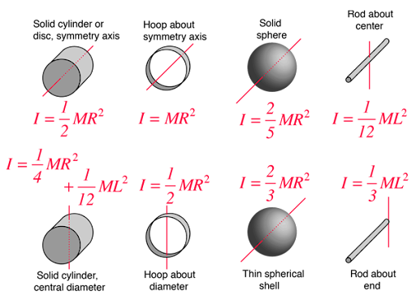

# PHYS 7A: Basic Physics I

## Table of Contents

1. Classical Mechanics
2. Quantum Mechanics
3. Relativistic Mechanics
4. Quantum Field Theory

## Motion

Define the origin to have a coordinate system. The position vector: $\vec{x}$.

**Distance**: total length of the path traveled.  
**Displacement**: how far moved from initial position, regardless of path taken. It has both ***magnitude*** and ***direction***, which is a vector. $\Delta x = x_2 - x_1$

**Speed**: scalar, how fast an object is moving. $speed = \frac{distance}{time}$  
**Velocity**: vector, rate of change of displacement. $velocity = \frac{displacement}{time}$
- *Average velocity*: $\bar{v} = \frac{\Delta x}{\Delta t}$. It is the ***slope*** between two points.
- *Instantaneous velocity*: $v = \lim\limits_{\Delta t \to 0} \frac{\Delta x}{\Delta t} = \frac{dx}{dt}$. It is the ***slope*** of the ***tangent line*** at a point.

**Acceleration**: vector, rate of change of velocity.
- *Average acceleration*: $\bar{a} = \frac{\Delta v}{\Delta t}$
- *Instantaneous acceleration*: $a = \lim\limits_{\Delta t \to 0} \frac{\Delta v}{\Delta t} = \frac{dv}{dt} = \frac{d^2x}{dt^2}$

Position function: $x(t)$  
Velocity function: $v(t) = \frac{dx}{dt}$  
Acceleration function: $a(t) = \frac{dv}{dt} = \frac{d^2x}{dt^2}$

### 1D Kinematics with Constant Acceleration

1. $v_t = v_0 + at$
2. $x_t = x_0 + v_0t + \frac{1}{2}at^2$
3. $v_t^2 - v_0^2 = 2a(x_t - x_0) = 2a\Delta x$
4. $x_t = x_0 + \frac{1}{2}(v_0 + v_t)t$

### Free Fall

All objects fall with the same constant gravitational acceleration $g \approx 9.81 m/s^2$ downward, neglecting air resistance.

Simple free fall:
1. $v_t = gt$
2. $y_t = \frac{1}{2}gt^2$
3. $v_t^2 = 2gy_t$
4. $y_t = \frac{1}{2}vt$

General free fall:
1. $v_t = v_0 - gt$
2. $y_t = y_0 - \frac{1}{2}gt^2$
3. $v_t^2 - v_0^2 = -2g(y_t - y_0) = -2g\Delta y$
4. $y_t = y_0 + \frac{1}{2}(v_0 + v_t)t$

### 1D Kinematics with Varying Acceleration

- $v(t) = v_0 + \int_{t_0}^{t} a(t) dt$
- $x(t) = x_0 + \int_{t_0}^{t} v(t) dt$

### 2D Kinematics

### Projectile Motion

- Initial velocity components:
  - $v_{0x} = v_0 \cos \theta$
  - $v_{0y} = v_0 \sin \theta$
- Horizontal motion: constant velocity
  - $v_x(t) = v_{0x}$
  - $x(t) = x_0 + v_{0x}t$
- Vertical motion: constant acceleration
  - $v_y(t) = v_{0y} - gt$
  - $y(t) = y_0 + v_{0y}t - \frac{1}{2}gt^2$
- Time of flight: $t = \frac{2v_{0y}}{g}$
  - General case: $t = \frac{v_{0y} + \sqrt{v_{0y}^2 + 2gy_0}}{g}$
- Range:   
$\begin{aligned} 
R 
&= v_{0x} t_g \\
&= v_0 \cos \theta \cdot \frac{2v_0 \sin \theta}{g} \\
&= \frac{v_0^2 \sin 2\theta}{g} \\
\end{aligned}$
  - Maximum range at $\theta = 45^\circ$
- Maximum height: $H = \frac{v_{0y}^2}{2g}$
- Angle: $\theta = \arctan \left( \dfrac{v_y}{v_x} \right)$

A ball is fired directly at a target located a horizontal distance $D$ away and a vertical height $H$ above the launch point. At the instant the ball is launched, the target is released and begins to free fall.  
The ball will always hit the target, regardless of the initial speed of the ball, because $\tan \theta = \frac{v_y}{v_x} = \frac{H}{D}$.

## Forces

**Force**: a vector action that can change an object's motion. $\vec{F}$ in Newtons (N).  
**Principle of Superposition**: The net force acting on an object is the vector sum of all individual forces acting on it. $\vec{F}_{net} = \sum \vec{F}_i$

### Newton's Laws of Motion

#### First Law (Law of Inertia)

First Law: An object at rest stays at rest, and an object in motion stays in motion with constant velocity, unless acted upon by a net external force.

**Inertia**: the tendency of an object to resist changes in its state of motion. The greater the mass of an object, the greater its inertia.  
**Mass** is a measure of an object's inertia, regardless of its location. $m$ in kilograms (kg).  
**Weight** is the gravitational force acting on an object. $\vec{W} = m\vec{g}$ in Newtons (N).

#### Second Law

Second Law: The net force acting on an object is equal to the mass of the object multiplied by its acceleration. Alternatively, an object subjected to a net force will accelerate in the direction of the net force, with a magnitude proportional to the net force and inversely proportional to its mass.
$\vec{F}_{net} = m\vec{a}$.  
$\vec{F}_X = m\vec{a}_X$, $\vec{F}_Y = m\vec{a}_Y$

Therefore, $1 N = 1 kg·m/s²$  

#### Third Law

Third Law: For every action, there is an equal and opposite reaction. If object A exerts a force on object B, then object B exerts a force of equal magnitude but in the opposite direction on object A. $\vec{F}_{AB} = -\vec{F}_{BA}$

### Free Body Diagrams

A free body diagram is a graphical representation used to visualize the forces acting on an object. It helps in analyzing the motion of the object by isolating it from its surroundings and representing all the external forces acting upon it.

### Common Forces

- **Gravitational Force**: $G = F_g = mg$.
- **Normal Force**: $F_N$, perpendicular contact force exerted by a surface on an object.
- **Tension Force**: $F_T$, pulling force exerted by a rope or string. Equal and opposite on the two ends, otherwise the rope would break.
- **Frictional Force**: $f$, opposes relative motion between two surfaces in contact. ($\mu$: coefficient of friction)
  - Static Friction: $f_s = F_{push} \le \mu_s F_N$
  - Kinetic Friction: $f_k = \mu_k F_N$
  - $\mu_s > \mu_k$
  - One an incline, $F_N = mg \cos \theta$
- **Air Resistance**: $f_{air}$, opposes motion through air, often modeled as $f_{air} = -bv$ or $f_{air} = -cv^2$

### Machines

#### Simple Machines

Simple machines are devices that change the direction or magnitude of a force, making it easier to perform work. The six classical simple machines are:

1. Lever
2. Wheel and Axle
3. Pulley
4. Inclined Plane
5. Wedge
6. Screw

#### Inclined Plane

For an inclined plane with angle $\theta$:
- $f = F_{parallel} = mg \sin \theta$
- $F_N = F_{perpendicular} = mg \cos \theta$
- $\mu = \tan \theta_{max}$

#### Pulley

A pulley consists of a wheel with a grooved rim through which a rope or cable can run to change the direction of the applied force. Pulleys can be used to lift heavy loads with less effort.

- Fixed Pulley: Changes the direction of the force. Mechanical advantage = 1.
- Movable Pulley: Reduces the amount of input force needed to lift a load. Mechanical advantage = 2.
- Block and Tackle: Combination of fixed and movable pulleys. Mechanical advantage = number of supporting rope segments.

## Circular Motion

**Uniform Circular Motion**: motion in a circle at constant speed.

The magnitude doesn't change, but the direction changes, so there is acceleration.

- Centripetal (Radial) Acceleration: $a_c = \frac{v^2}{r}$, directed toward the center of the circle.
- Centripetal Force: $F_c = m a_c = \frac{mv^2}{r}$
- Period: $T = \frac{2\pi r}{v}$ (time taken to complete one revolution)
- Frequency: $f = \frac{1}{T} = \frac{v}{2\pi r}$ (number of revolutions per second)
- Angular Velocity: $\omega = \frac{2\pi}{T} = 2\pi f$ (radians per second)
- Relationship between linear and angular quantities:
  - $v = \omega r$
  - $a_c = \omega^2 r$

Non-uniform circular motion: $\vec{a} = \vec{a}_c + \vec{a}_t$

## Energy

**Work**: the transfer of energy by a force acting over a displacement. $W = \vec{F} \cdot \vec{d} = Fd \cos \theta$ in **Joules (J)**.  
Varying force: $W = \int_{x_0}^{x} \vec{F}(x) \cdot d\vec{x}$

**Hooke's Law**: $\vec{F} = -k\vec{x}$, the restoring force for a spring, where $k$ is the spring constant.  

**Kinetic Energy**: the energy possessed by an object due to its motion. $K = \frac{1}{2}mv^2$.  
**Potential Energy**: the energy stored in an object due to its position or configuration.
  - **Gravitational Potential Energy**: $U = mgh$.  
  - **Elastic Potential Energy**: $U = \frac{1}{2}kx^2$.  

**Mechanical Energy**: the sum of kinetic and potential energy. $E = K + U$ (constant).  
**Conservation of Mechanical Energy**: In the absence of non-conservative forces (like friction), the total mechanical energy of a system remains constant. $E_i = E_j$ or $\Delta E = 0$.

**Work-Energy Principle**: The net work done on an object is equal to the change in its kinetic energy. $W_{net} = \Delta K$, $W_{net} = -\Delta U$, or $W_{net} = \Delta K + \Delta U$.

**Power**: the rate at which work is done or energy is transferred. $P = \frac{W}{t} = \vec{F} \cdot \vec{v}$ in **Watts (W)**.

**Conservative forces**: the work done is independent of the path taken. Examples include gravitational and elastic forces.  
**Dissipative forces** (like friction) convert mechanical energy into other forms (like heat), so mechanical energy is not conserved. However, total energy is always conserved.  

**Law of Conservation of Energy**: The total energy of an isolated system remains constant; it can only be transformed from one form to another.

$W_{non-conservative} = \Delta K + \Delta U$ or $W_{non-conservative} = \Delta E_{mechanical}$

## Momentum

**Momentum**: the quantity of motion an object has. $\vec{p} = m\vec{v}$ in **kg·m/s**.  
The rate of change of momentum is equal to the net force acting on an object. $\vec{F} = \frac{d\vec{p}}{dt}$.  
**Impulse**: the change in momentum of an object when a force is applied over a time interval. $\vec{J} = \Delta \vec{p} = \vec{F} \Delta t$ in **N·s**.  
**Law of Conservation of Linear Momentum**: In the absence of external forces, the total momentum of an isolated system remains constant. $\vec{p}_{initial} = \vec{p}_{final}$ or $\Delta \vec{p} = 0$.

### Collisions

- **Elastic Collision**: both *momentum* and *kinetic energy* are conserved.
  - $\begin{aligned}
  m_1 v_1 + m_2 v_2 &= m_1 v_1' + m_2 v_2' \\
  \frac{1}{2} m_1 v_1^2 + \frac{1}{2} m_2 v_2^2 &= \frac{1}{2} m_1 v_1'^2 + \frac{1}{2} m_2 v_2'^2
  \end{aligned}$
  - The relative speed has the same magnitude in opposite directions: $v_1 - v_2 = -(v_1' - v_2')$.
  - $v_1' = \frac{(m_1 - m_2)v_1 + 2m_2 v_2}{m_1 + m_2}$
  - $v_2' = \frac{(m_2 - m_1)v_2 + 2m_1 v_1}{m_1 + m_2}$
- **Inelastic Collision**: *momentum* is conserved, but *kinetic energy* is not conserved.
- **Completely Inelastic Collision**: a special case of inelastic collision where the colliding objects stick together after the collision, moving with a common velocity. *Momentum* is conserved, but *kinetic energy* is not conserved.
  - $v' = \frac{m_1 v_1 + m_2 v_2}{m_1 + m_2}$
  - $\Delta K = \frac{1}{2} (m_1 + m_2) v'^2 - \frac{1}{2} m_1 v_1^2 - \frac{1}{2} m_2 v_2^2$
- **Coefficient of Restitution**: the ratio of the relative speed after the collision to the relative speed before the collision. $e = \frac{v_2' - v_1'}{v_1 - v_2}$

Collisions in 2D: The momentum preserves in both x and y directions.

## Center of Mass

**Center of Mass**: the average position of the mass of an object.

For a system of particles, the center of mass is given by:
$\vec{r}_{cm} = \frac{1}{M} \sum\limits_{i=1}^{n} m_i \vec{r}_i$, which is $x_{cm} = \frac{\sum\limits m_i x_i}{M}$, $y_{cm} = \frac{\sum\limits m_i y_i}{M}$, $z_{cm} = \frac{\sum\limits m_i z_i}{M}$.

For a continuous object, the center of mass is given by:
$\vec{r}_{cm} = \frac{1}{M} \int \vec{r} dm$

where $M$ is the total mass of the object.

The center of mass of a system of particles (or objects) moves like a single particle of mass $M$ under the influence of the same net external force. $\vec{F}_{net} = M \vec{a}_{cm} = \sum\limits_{i=1}^{n} m_i \vec{a}_i$

The **general motion** of any object is a combination of CM's translational motion and rotational, vibrational, and other motions around the CM.

## Rotational Motion

**Rotational Motion**: motion of an object around a fixed axis.
Rigid object: an object that does not deform under the application of forces.  
Axis of rotation: a line around which the object rotates.

- $P$: position vector of a point P
- $l$: distance point P travels along the arc
- $r$: radius of the circular path
- $\theta$: angular position of P, $\theta = \frac{l}{r}$, in radians
- Angular velocity: $\omega = \frac{\theta}{t}$
- Angular acceleration: $\alpha = \frac{\omega}{t}$
- Linear velocity: $v = \frac{l}{t} = \omega r$
- Tangential linear acceleration: $a_{tan} = \frac{v}{t} = \alpha r$
- Total linear acceleration: $a = a_{cen} + a_{tan} = \omega^2 r + \alpha r$
- Centripetal torque: $\tau_c = I \alpha = I \frac{\omega^2}{r}$

Direction of angular acceleration: "right-hand rule": curl fingers of right hand in the direction of rotation, the thumb points in the direction of the angular acceleration.

### Moment of Inertia (rotational equivalent of mass)

**Moment of Inertia**: the . $I = \sum\limits_{i=1}^{n} m_i r_i^2$ for a system of particles, $I = \int r^2 dm$ for a continuous object.  
$I = mr^2$ where $r$ is the distance from the axis of rotation to the mass.

**Parallel Axis Theorem**: $I_P = I_{CM} + Md^2$. $P$ is the point of rotation, $d$ is the distance between the point of rotation and the center of mass, $M$ is the mass of the object. $I_{CM}$ is the moment of inertia about the center of mass.

### Energy of Rotational Motion (rotational equivalent of kinetic energy)

**Rotational Kinetic Energy**: the energy possessed by an object due to its rotational motion. $K_{rot} = \frac{1}{2}I\omega^2$. **Work-Energy Principle** applies.

### Torque (rotational equivalent of force)

**Torque**: $\vec{\tau} = \vec{R} \times \vec{F}$ in **N·m**. $\tau = RF_{\perp} = RF \sin \theta$.

Right-hand rule: curl fingers of right hand in the direction of rotation, the thumb points in the direction of the torque.

### Angular Momentum (rotational equivalent of momentum)

**Angular Momentum**: the rotational equivalent of momentum. $\vec{L} = \vec{I} \times \vec{\omega}$ in **kg·m²/s**.

**Law of Conservation of Angular Momentum**: In the absence of external torques, the angular momentum of a rigid object remains constant. $\vec{L}_{initial} = \vec{L}_{final}$ or $\Delta \vec{L} = 0$.

## General Motion of a Rigid Object

