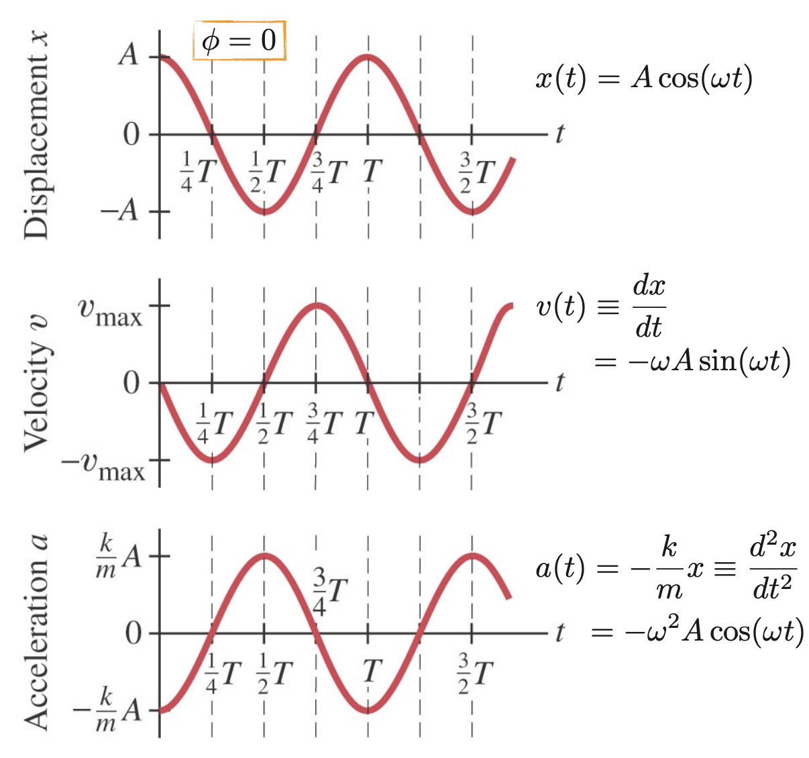

# PHYS 7B: Basic Physics II

## Table of Contents

## Gravitation

**Universal Law of Gravitation**:
$$
F_G = G \frac{m_1 m_2}{r^2}
$$
where $G \approx 6.67 \times 10^{-11} \, \text{N} \cdot \text{m}^2/\text{kg}^2 $ is the **gravitational constant**.

**Gravitational Field**:
$$
g = \frac{F_G}{m} = G \frac{M}{r^2}
$$

### Satellite Motion

For a satellite in circular orbit around a planet:
$$F_G = \frac{mv^2}{r} = G \frac{Mm}{r^2}$$
which leads to the orbital velocity:
$$v = \sqrt{\frac{GM}{r}}$$

$a_R = \frac{v^2}{r} = \frac{GM}{r^2} = g$ is the centripetal acceleration, which is equal to the gravitational acceleration at that radius.

The period of the satellite is:
$$T = \frac{2\pi r}{v} = 2\pi \sqrt{\frac{r^3}{GM}}$$
This is known as **Kepler's Third Law**.

### Escape Velocity

The escape velocity from a planet is the minimum velocity needed for an object to escape the gravitational pull of the planet without further propulsion:
$$v_{esc} = \sqrt{\frac{2GM}{R}}$$
where $R$ is the radius of the planet.

### Gravitational Potential Energy

The work against gravity to move a mass $m$ from a distance $r_1$ to $r_2$ is given by:
$$W = \int_{r_1}^{r_2} F_G \, dr = \int_{r_1}^{r_2} G \frac{Mm}{r^2} \, dr = G Mm \left( \frac{1}{r_2} - \frac{1}{r_1} \right)$$
The gravitational potential energy at a distance $r$ from a mass $M$ is, where $U(\infty) = 0$:
$$U(r) = -G \frac{Mm}{r}$$

The negative sign indicates that the potential energy is lower (more negative) when the masses are closer together, reflecting the attractive nature of gravity. The potential energy approaches zero as $r$ approaches infinity, which means that it takes an infinite amount of energy to separate the masses completely.

## Oscillations

### Simple Harmonic Oscillator

Hooke's Law: $F_s = -kx$ where $k$ is the spring constant and $x$ is the displacement from equilibrium.
$$
\begin{aligned}
F &= ma \\
-kx &= m \frac{d^2x}{dt^2} \\
\frac{d^2x}{dt^2} + \frac{k}{m} x &= 0 \\
\omega &= \sqrt{\frac{k}{m}} \\
\end{aligned}
$$
The general solution to the equation of motion is:
$$x(t) = A \cos(\omega t + \phi)$$
where $A$ is the **amplitude**, $\omega$ is the **angular frequency**, and $\phi$ is the **phase** constant determined by initial conditions.
- Period: $ T = \frac{2\pi}{\omega} = 2\pi \sqrt{\frac{m}{k}}$.
- The total energy of the system is conserved and given by:
$$E = \frac{1}{2}mv^2 + \frac{1}{2}kx^2 = \frac{1}{2}kA^2$$
Thus, $x^2 + \left( \frac{v}{\omega} \right)^2 = A^2$.

### Simple Pendulum

For small angles ($\theta \approx \sin \theta$):
$$
\begin{aligned}
F_\theta &= ma_\theta \\
-mg \sin \theta &= mL\alpha \\
-mg \sin \theta &= mL \frac{d^2\theta}{dt^2} \\
\frac{d^2\theta}{dt^2} + \frac{g}{L} \theta &= 0 \\
\omega &= \sqrt{\frac{g}{L}} \\
\end{aligned}
$$
where $L$ is the length of the pendulum and $g$ is the acceleration due to gravity.

The period is: $T = 2\pi \sqrt{\frac{L}{g}}$

### Physical Pendulum

For a physical pendulum, the moment of inertia $I$ and the distance $d$ from the pivot to the center of mass are used:

$$\begin{aligned}
\tau &= I \alpha \\
-mgd \sin \theta &= I \frac{d^2\theta}{dt^2} \\
\frac{d^2\theta}{dt^2} + \frac{mgd}{I} \theta &= 0 \\
\omega &= \sqrt{\frac{mgd}{I}} \\
\end{aligned}$$
The period is: $T = 2\pi \sqrt{\frac{I}{mgd}}$