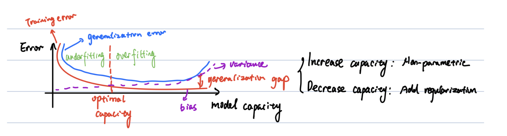

## 1. ML Foundations

### Tasks, Experience, Measurement
* **Tasks:** classification, regression, clustering, anomaly detection, density estimation, imputation, synthesis.
* **Experience:** supervised ($x, y$) vs unsupervised ($x$ only).
  * Unsup → Sup: $p(y|x) = \dfrac{p(x,y)}{\sum_{y'} p(x,y')}$
  * Sup → Unsup: $p(x) = \prod_i p(x_i \mid x_1,\dots,x_{i-1})$
* **Measurement:** accuracy, precision, recall, F1, calibration error, ROC, AUC.

### Risks
$$R_{\text{emp}}(f) = \frac{1}{n}\sum_i L(f(x_i), y_i) \quad \text{(training-set average)}$$
$$R(f) = \mathbb{E}_{x \sim p}[L(f(x), y)] \quad \text{(true expected loss, unknown)}$$
$$R_{\text{struct}}(f) = R_{\text{emp}}(f) + \lambda \cdot \text{regularizer}$$

**Generalization gap** = $R(f) - R_{\text{emp}}(f)$. Closes with more data, opens with more capacity.

### Capacity & Errors
* **Capacity:** model's ability to fit functions. Increase via non-parametric models; decrease via regularization.
* **Model error:** can the hypothesis class represent the truth?
* **Data error:** sampling noise.
* **Optimization error:** can we actually find the optimum?

### Bias-Variance
| | Bias | Variance | Train | Test |
|---|---|---|---|---|
| Underfit | high | low | high | high |
| Overfit | low | high | low | high |

* **k-NN:** $k=1$ → low bias, high variance. $k=N$ → high bias, low variance.
* **Double descent:** test error can fall again past interpolation threshold (deep models).

---

## 2. Probability

### Basic Rules
* $P(A \cup B) = P(A) + P(B) - P(A \cap B)$
* $P(A,B) = P(A|B)P(B)$
* Marginal: $P(A) = \sum_b P(A|B{=}b)P(B{=}b)$
* Chain: $p(x_{1:D}) = p(x_1)p(x_2|x_1)\cdots p(x_D|x_{<D})$
* Independence: $X \perp Y \iff p(x,y)=p(x)p(y)$
* Conditional independence: $X \perp Y \mid Z \iff p(x,y|z) = p(x|z)p(y|z)$
* **Bayes:** $p(\theta|D) = \dfrac{p(D|\theta)p(\theta)}{p(D)}$

### Expectation & Variance
* $\mathbb{E}[\sum_i x_i] = \sum_i \mathbb{E}[x_i]$
* Tower rule: $\mathbb{E}[X] = \mathbb{E}_Y[\mathbb{E}[X|Y]]$
* $\text{Var}[X] = \mathbb{E}[X^2] - (\mathbb{E}[X])^2$
* $\text{Var}[aX+b] = a^2 \text{Var}[X]$
* Law of total variance: $\text{Var}[X] = \mathbb{E}_Y[\text{Var}[X|Y]] + \text{Var}_Y[\mathbb{E}[X|Y]]$

### Common Distributions
| Distribution | Use | Key fact |
|---|---|---|
| Bernoulli($\theta$) | Binary classification | $p(y) = \theta^y(1-\theta)^{1-y}$, sigmoid |
| Categorical | Multi-class | softmax: $p_c = e^{a_c}/\sum_{c'} e^{a_{c'}}$ |
| Binomial | Repeated Bernoulli | $\binom{n}{k}\theta^k(1-\theta)^{n-k}$ |
| Gaussian | Noise, residuals | $\mathcal{N}(\mu, \sigma^2)$ |
| Beta($\alpha, \beta$) | Prior for Bernoulli | conjugate |
| Dirichlet | Prior for Categorical | conjugate |
| Laplace | Sparse noise | sharp peak, heavy tails |

### Monty Hall (Bayes example)
Pick door 1, Monty opens door 3. $P(C_i) = 1/3$.
$P(M_3|C_1)=1/2,\ P(M_3|C_2)=1,\ P(M_3|C_3)=0$.
$P(M_3) = 1/2$.
$P(C_2|M_3) = \dfrac{1 \cdot 1/3}{1/2} = 2/3$. **Switch.**

---

## 3. Information Theory

### Entropy
$$H(X) = -\sum_x p(x)\log p(x)$$
Average surprise. Fair coin: $H = 1$ bit. Pure: $H = 0$.

### KL Divergence
$$\text{KL}(p \Vert q) = \mathbb{E}_{x \sim p}\!\left[\log \frac{p(x)}{q(x)}\right] \geq 0$$
Asymmetric. Zero iff $p = q$.

### Cross Entropy
$$H(p, q) = -\mathbb{E}_{x \sim p}[\log q(x)] = H(p) + \text{KL}(p \Vert q)$$
Minimizing $H(p,q)$ over $q$ is the same as minimizing $\text{KL}(p \Vert q)$.

### Mutual Information
$$I(X, Y) = H(X) + H(Y) - H(X, Y)$$
Captures non-linear dependence.

### Jensen's Inequality
For convex $f$: $f(\mathbb{E}[X]) \leq \mathbb{E}[f(X)]$.

### The Master Identity
$$\text{MLE} \iff \min \text{NLL} \iff \min \text{Cross Entropy} \iff \min \text{KL}(p_{\text{data}} \Vert p_{\text{model}})$$

---

## 4. Estimators

### MLE
$$\hat{\theta}_{\text{MLE}} = \arg\max_\theta \log p(D|\theta)$$
Bernoulli: $\hat{\theta} = k/n$. Linear-Gaussian: $\hat{\mathbf{w}} = (X^TX)^{-1}X^T\mathbf{y}$.

### MAP
$$\hat{\theta}_{\text{MAP}} = \arg\max_\theta p(D|\theta)p(\theta) = \arg\max_\theta \big[\log p(D|\theta) + \log p(\theta)\big]$$

**Beta-Bernoulli:** prior $\text{Beta}(\alpha,\beta)$, $k$ heads in $n$ flips → posterior $\text{Beta}(\alpha+k, \beta+n-k)$.
$$\hat{\theta}_{\text{MAP}} = \frac{\alpha + k - 1}{\alpha + \beta + n - 2}$$

**MAP = MLE + regularization:**
* Gaussian prior on $\theta$ → L2 penalty (ridge).
* Laplace prior on $\theta$ → L1 penalty (lasso).

### Full Bayesian
$$p(y|x, D) = \int p(y|x,\theta) p(\theta|D) d\theta$$
Predict by averaging over posterior. Usually intractable.

### Empirical Bayes
$$\hat{\phi} = \arg\max_\phi \int p(D|\theta) p(\theta|\phi) d\theta$$
Use data to set hyperparameters of the prior.

---

## 5. Linear Algebra

### Norms & Trace
* Vector: $\|x\|_p = (\sum_i |x_i|^p)^{1/p}$
* Frobenius: $\|A\|_F = \sqrt{\sum_{ij} A_{ij}^2} = \sqrt{\text{Tr}(AA^T)}$
* Trace: $\text{Tr}(A) = \sum_i A_{ii}$. Cyclic: $\text{Tr}(ABC) = \text{Tr}(CAB)$.

### Linear Systems
$Ax = b$: unique solution iff $A$ square + invertible. Then $x = A^{-1}b$.

### Decompositions
* **Eigendecomposition:** $Av = \lambda v$.
* **SVD:** $A = U\Sigma V^T$. Use top singular values for dimension reduction.

---

## 6. Optimization

### Gradient Descent
$$\theta_{t+1} = \theta_t - \eta \nabla L(\theta_t)$$
* Too small $\eta$: slow. Too large: divergence.
* **SGD:** one sample. **Mini-batch:** batch of size $m$. **Batch:** full data.

### Momentum
$$m_t = \beta m_{t-1} + (1-\beta) g_t, \quad \theta_t = \theta_{t-1} - \eta m_t$$
Accelerates along consistent gradient directions.

### Newton's Method
$$\theta_{t+1} = \theta_t - H^{-1}\nabla L$$
Quadratic convergence; $O(d^3)$ per step. BFGS approximates Hessian.

### Adam, RMSprop, AdaGrad
Adaptive per-parameter learning rates. Standard in deep learning.

### Convexity
* Convex set: $\lambda x + (1-\lambda)y \in S$ for $x,y \in S$, $\lambda \in [0,1]$.
* Convex function: $f(\lambda x + (1-\lambda)y) \leq \lambda f(x) + (1-\lambda)f(y)$.
* Equivalent: $f''(x) \geq 0$ everywhere.
* Convex problems have unique global minimum.

### Optimality Conditions
* Necessary: $\nabla f = 0$.
* Sufficient (min): $\nabla f = 0$ AND Hessian PSD.
* Saddle: $\nabla f = 0$ but Hessian indefinite.

### Numerical Stability
* **Softmax:** subtract max before exp: $\text{softmax}(z_i) = \dfrac{e^{z_i - \max}}{\sum_k e^{z_k - \max}}$
* **Logsumexp:** $\log\sum_i e^{x_i} = \max_i x_i + \log\sum_i e^{x_i - \max_j x_j}$

---

## 7. Linear Regression

### Model
$$\hat{y} = \mathbf{w}^T\mathbf{x} \quad \text{(absorb bias by appending 1 to } \mathbf{x}\text{)}$$

### MSE Loss
$$L(\mathbf{w}) = \frac{1}{n}\sum_i (y_i - \mathbf{w}^T\mathbf{x}_i)^2$$

### Closed Form (Normal Equations)
$$\hat{\mathbf{w}} = (X^TX)^{-1}X^T\mathbf{y}$$
Cost $O(d^3)$ for the inverse. Use GD when $d$ is large.

### Ridge Regression (L2)
$$L(\mathbf{w}) = \|\mathbf{y} - X\mathbf{w}\|^2 + \lambda\|\mathbf{w}\|_2^2$$
$$\hat{\mathbf{w}}_{\text{ridge}} = (X^TX + \lambda I)^{-1} X^T\mathbf{y}$$
Also fixes singular $X^TX$.

### Derivation: MSE from MLE (Gaussian noise)
Assume $y = \mathbf{w}^T\mathbf{x} + \epsilon, \quad \epsilon \sim \mathcal{N}(0, \sigma^2)$.

So $p(y_i|\mathbf{x}_i, \mathbf{w}) = \mathcal{N}(y_i; \mathbf{w}^T\mathbf{x}_i, \sigma^2)$.

$$\log p(D|\mathbf{w}) = \sum_i \left[\log\frac{1}{\sqrt{2\pi}\sigma} - \frac{(y_i - \mathbf{w}^T\mathbf{x}_i)^2}{2\sigma^2}\right]$$

Drop $\mathbf{w}$-independent constants and the $\frac{1}{2\sigma^2}$ scalar:

$$\arg\max_{\mathbf{w}} \log p(D|\mathbf{w}) = \arg\min_{\mathbf{w}} \sum_i (y_i - \mathbf{w}^T\mathbf{x}_i)^2$$

**Conclusion:** Gaussian noise + MLE → least squares.

---

## 8. Classification

### Perceptron
$$f(\mathbf{x}) = \text{sign}(\mathbf{w}^T\mathbf{x} - t)$$
No probability output. Linear decision boundary.

### Logistic Regression
$$p(y=1|\mathbf{x}, \mathbf{w}) = \sigma(\mathbf{w}^T\mathbf{x}) = \frac{1}{1+e^{-\mathbf{w}^T\mathbf{x}}}$$
Inverse: $\log\dfrac{p}{1-p} = \mathbf{w}^T\mathbf{x}$ (logit linear in $\mathbf{x}$).

**Binary cross-entropy loss** (NLL of Bernoulli):
$$L(\mathbf{w}) = -\frac{1}{n}\sum_i \big[y_i \log \hat{p}_i + (1-y_i)\log(1-\hat{p}_i)\big]$$

**Gradient** (clean form):
$$\nabla_{\mathbf{w}} L = \frac{1}{n} X^T(\hat{\mathbf{p}} - \mathbf{y})$$

**Decision boundary:** $\sigma(\mathbf{w}^T\mathbf{x}) = 0.5 \iff \mathbf{w}^T\mathbf{x} = 0$. Linear, despite non-linear sigmoid.

No closed form. Train via GD.

### Derivation: BCE from MLE (Bernoulli)
$y_i \sim \text{Bernoulli}(\hat{p}_i)$, $\hat{p}_i = \sigma(\mathbf{w}^T\mathbf{x}_i)$.

$$p(y_i|\mathbf{x}_i, \mathbf{w}) = \hat{p}_i^{y_i}(1-\hat{p}_i)^{1-y_i}$$

$$\log p(D|\mathbf{w}) = \sum_i \big[y_i \log \hat{p}_i + (1-y_i)\log(1-\hat{p}_i)\big]$$

Negate + average:
$$-\frac{1}{n}\log p(D|\mathbf{w}) = \text{BCE loss}$$

### Softmax Regression (Multi-class)
$$p(y=c|\mathbf{x}) = \frac{e^{\mathbf{w}_c^T\mathbf{x}}}{\sum_{c'} e^{\mathbf{w}_{c'}^T\mathbf{x}}}$$
Loss: categorical cross-entropy.

### Margin & SVM
Margin of point $\mathbf{x}$:
$$\text{margin}(\mathbf{x}) = \frac{y(\mathbf{w}^T\mathbf{x} - t)}{\|\mathbf{w}\|}$$
Positive iff correctly classified.

**SVM:** maximize minimum margin. Equivalent to:
$$\min_{\mathbf{w}} \frac{1}{2}\|\mathbf{w}\|^2 \text{ s.t. } y_i(\mathbf{w}^T\mathbf{x}_i - t) \geq 1$$
**Support vectors:** points exactly on the margin edge. Solution is sparse.

### Classifier Types
* **Scoring:** outputs real-valued score; threshold to decide.
* **Class probability estimator:** scores calibrated as probabilities (logistic).
* **Ranking:** sort by score; threshold-free metric is AUC.

---

## 9. Loss Functions

### Regression
| Loss | Formula | Outliers | Gradient near 0 |
|---|---|---|---|
| MSE | $(y - \hat{y})^2$ | Sensitive | Shrinks |
| MAE | $|y - \hat{y}|$ | Robust | Constant $\pm 1$ |
| Huber | piecewise (below) | Medium | Shrinks |

**Huber loss:**
$$\ell(y, \hat{y}) = \begin{cases} \tfrac{1}{2}(y - \hat{y})^2 & |y - \hat{y}| \leq \delta \\ \delta(|y - \hat{y}| - \tfrac{1}{2}\delta) & \text{otherwise} \end{cases}$$
Continuous and smooth at $|y - \hat{y}| = \delta$. Both pieces equal $\tfrac{1}{2}\delta^2$ at boundary.

### Classification
| Loss | Use |
|---|---|
| Zero-one | True objective; non-differentiable |
| Cross-entropy (BCE/CCE) | Standard; from MLE |
| Hinge: $\max(0, 1 - y\,f(\mathbf{x}))$ | SVM |

---

## 10. Classification Metrics

### Confusion Matrix (binary)
|  | Pred + | Pred − |
|---|---|---|
| Actual + | TP | FN |
| Actual − | FP | TN |

### Formulas
* **Accuracy:** $(TP + TN) / N$. Fails on imbalance.
* **Precision:** $TP / (TP + FP)$. "Of called positive, how many right?"
* **Recall (TPR):** $TP / (TP + FN)$. "Of actual positives, how many caught?"
* **F1:** $2 \cdot \dfrac{P \cdot R}{P + R}$. Harmonic mean.
* **FPR:** $FP / (FP + TN)$.
* **Specificity:** $TN / (TN + FP) = 1 - \text{FPR}$.
* **False discovery rate:** $FP / (TP + FP) = 1 - P$.

### ROC & AUC
* ROC: TPR vs FPR as threshold varies.
* AUC: probability a random positive scores higher than a random negative.
* AUC = 1: perfect. 0.5: random. 0: inverted.

### Multi-class
Per-class precision/recall computed from $K \times K$ confusion matrix. Macro-average (mean of per-class) vs micro-average (pooled counts).

---

## 11. Decision Trees

### Structure
Internal nodes test features; leaves predict labels. Path = conjunction of literals; tree = disjunction of positive paths. Maximally expressive.

### Impurity Measures
* **Entropy:** $H(S) = -\sum_c p(c)\log_2 p(c)$
* **Gini:** $1 - \sum_c p(c)^2$
* **MSE** (regression trees): variance of targets in node.

### Information Gain
$$IG = H(\text{parent}) - \frac{|L|}{|P|}H(L) - \frac{|R|}{|P|}H(R)$$
Pick split with max IG.

### Building Algorithm
1. For each (feature, threshold), compute IG.
2. Pick split with max IG.
3. Partition data; recurse on children.
4. Stop on max depth, min samples, pure node, or IG below threshold.

### Regression Trees
* Prediction = mean of training targets in leaf.
* Impurity = variance / MSE.

### Overfitting Control
Pre-pruning (max depth, min samples). Post-pruning (remove branches that hurt validation). Ensembles (random forest, boosting).

### Inductive Bias
Prefers shallow, axis-aligned partitions. Greedy local choices may miss globally optimal tree.

## 13. The Master Picture

### Loss ↔ Likelihood
| Noise model | Likelihood | NLL = Loss |
|---|---|---|
| Gaussian | $\mathcal{N}(y; \hat{y}, \sigma^2)$ | MSE |
| Laplace | $\propto e^{-|y - \hat{y}|/b}$ | MAE |
| Bernoulli | $\hat{p}^y(1-\hat{p})^{1-y}$ | BCE |
| Categorical | $\prod_c \hat{p}_c^{y_c}$ | Cross-entropy |

### Estimator ↔ Regularization
| Estimator | Adds | In regression |
|---|---|---|
| MLE | nothing | OLS |
| MAP, Gaussian prior | L2 penalty | Ridge |
| MAP, Laplace prior | L1 penalty | Lasso |

### Equivalence Chain
$$\text{Pick noise model} \to \text{Likelihood} \to \text{NLL = Loss} \to \text{MLE} \xrightarrow{+\text{ prior}} \text{MAP = regularized}$$

## test

## Problem 1: Linear Model

### I.

**(a)**

$$\text{MSE} = \frac{1}{n} \sum_{i=1}^{n} \big(y_i - (wx_i + b)\big)^2$$

**(b)**

Assume the data is generated as $y \mid x \sim \mathcal{N}(wx + b,\ \sigma^2)$, so

$$p_{\text{model}}(y \mid x, w, b) = \frac{1}{\sqrt{2\pi\sigma^2}} \exp\!\left(-\frac{(y - wx - b)^2}{2\sigma^2}\right)$$

Taking log:

$$\log p_{\text{model}}(y \mid x, w, b) = -\tfrac{1}{2}\log(2\pi\sigma^2) - \frac{(y - wx - b)^2}{2\sigma^2}$$

MLE maximizes $\mathbb{E}_{(x,y) \sim p_{\text{data}}}[\log p_{\text{model}}]$. The $\log(2\pi\sigma^2)$ term is constant, so maximizing the expected log-likelihood is equivalent to minimizing $\mathbb{E}[(y - wx - b)^2]$.

### II

**(a)**

$$\text{MSE} = \frac{1}{n} \sum_{i=1}^{n} \big(y_i - (w^\top x_i + b)\big)^2$$

**(b)**

Absorb the bias by adding features: let $\tilde{x}_i = [x_i;\ 1]$ and $\tilde{w} = [w;\ b]$, so $\hat{y}_i = \tilde{w}^\top \tilde{x}_i$.  
Let $\tilde{X}$ have rows $\tilde{x}_i^\top$, and $y$ be the label vector.

$$\text{Loss} = \tfrac{1}{n}\|y - \tilde{X}\tilde{w}\|_2^2$$

Setting the gradient to zero:
$$
\begin{aligned}
\nabla_{Loss} = -\tfrac{2}{n}(\tilde{X}^\top y - \tilde{X}^\top \tilde{X}\tilde{w}) &= 0 \\
\tilde{X}^\top \tilde{X}\, \tilde{w} &= \tilde{X}^\top y \\
\tilde{w}^* &= (\tilde{X}^\top \tilde{X})^{-1} \tilde{X}^\top y
\end{aligned}
$$

### III.

$p(y_i = 1 \mid x_i) = \hat{y}_i$ and $p(y_i = 0 \mid x_i) = 1 - \hat{y}_i$.

$$\text{NLL} = -\frac{1}{n} \sum_{i=1}^{n} \Big[ y_i \log \sigma(w^\top x_i + b) + (1 - y_i)\log\big(1 - \sigma(w^\top x_i + b)\big) \Big]$$